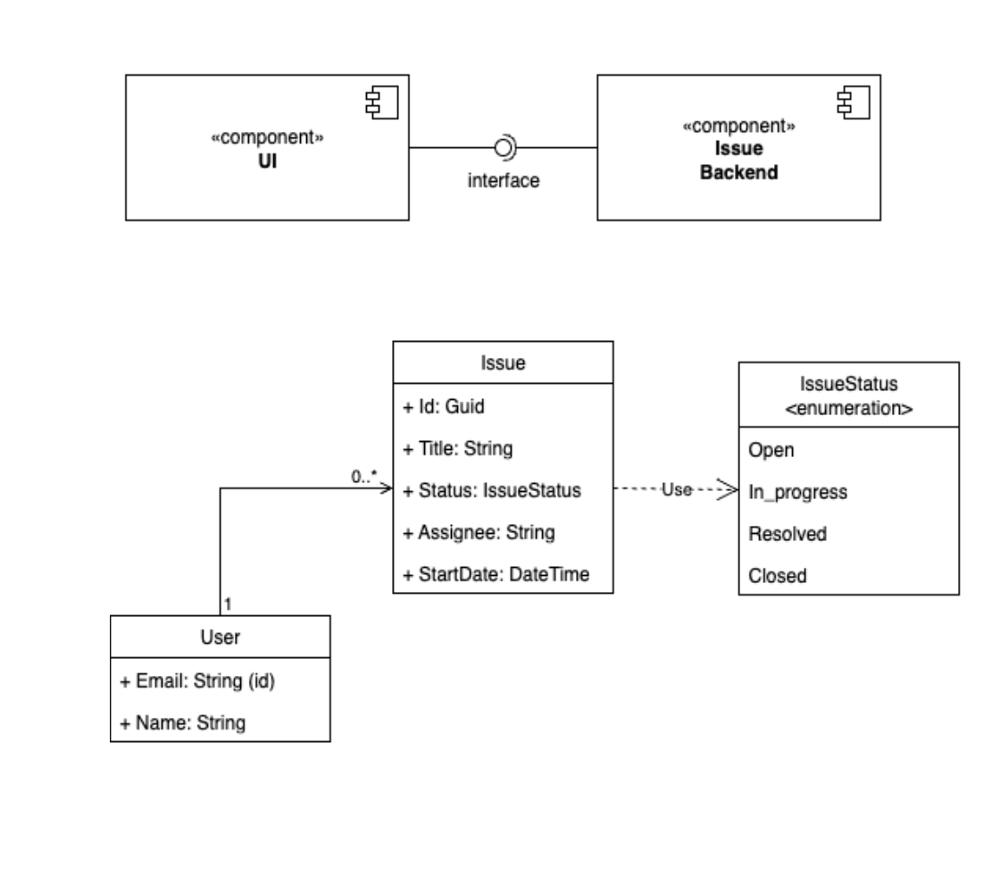

# Issue Tracker Lite by Jaakko Mäkäräinen

## Overview
This is an issue tracker POC created using Express.js, Typescript, React.js and sqlite3.

The issue tracker allows creation, viewing and deletion of issues. You can view all issues or issues assigned to a specific user. Configured users hardcoded in the backend database are `a@user.com`, `b@user.com`, and `c@user.com`, and these are the only valid Assignee Emails. After creating an issue, you need to click Get All Issues or Get Issues For User to see them.

## Running instructions:
- install node v22.18.0
- install yarn v1.22.19
- in repo root:
    - run `yarn install`
    - run `yarn start-backend` to create the database and required tables, and to start the backend
    - open a new terminal and run `yarn start-frontend` to start frontend and test the app

## TO-DO:
- features
    - The UI should validate against empty or invalid field values rather than relying only on backend
    - The UI should display an error message when one is returned from the backend, e.g. due to invalid user or empty required field values
    - submission of a new issue should refresh the issue list
    - clicking the Delete button on a row should remove that row from the table without needing to refresh the issuelist
    - implement creation of new users
    - implement issue editing functionality eg description or comments
    - implement authentication / login
- UI / design: make it prettier :D
- technical
    - implement unit tests
    - update frontend to use Next.js for better performance
    - move backend.ts to src folder and share IssueStatus enum between backend and frontend
    - dependency injection
- security
    - parametrising SQL queries to avoid SQL injection in the backend
    - require username and password to access the app / modify issues.
- AWS Deployment suggestion: Host it as an S3 website talking to API Gateway which is connected to RDS Aurora Serverless database. RDS SQL is capable of generating UUIDs, and since this is the only logic performed by the current backend in addition to Database operations and API creation, this simple app as-is has no need for a Lambda function. A Lambda function can easily be integrated later as needed through a new API Gateway endpoint which can be integrated directly with Lambda. 
Enable Cloudwatch logging on RDS Aurora and API Gateway to monitor traffic, and rate limiting and AWS WAF on the API to restrict traffic to allowed IP address ranges (eg an internal company network).
Since all the services used in this suggested solution are serverless, they scale automatically and require no infrastructure maintenance.
